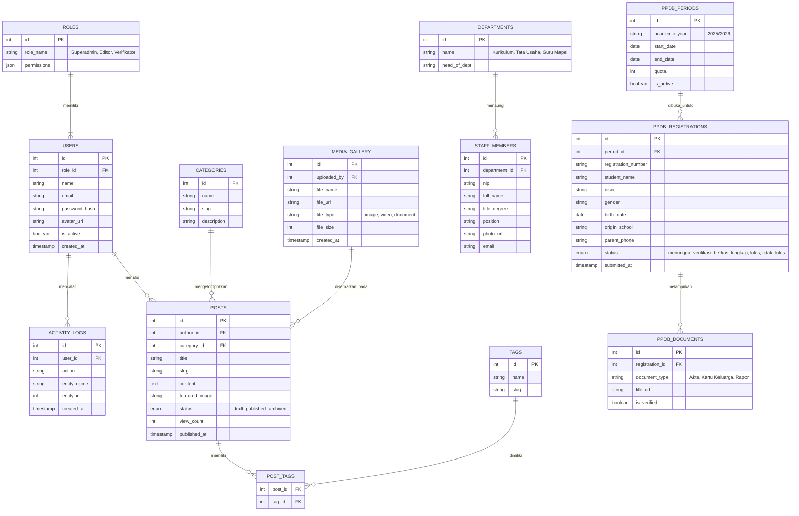

# PERANCANGAN SISTEM: SCHOOL OF PEOPLE PEOPLE HAVE / COMPANY PROFILE
**Milestone 1 (Pekan Ke-3): Perencanaan Menu & UI Wireframing**

---

## 1. Pendahuluan & Ringkasan Proyek
Sistem ini merupakan platform manajemen konten terpadu untuk pengelolaan website profil sekolah dan informasi publik. Platform ini memfasilitasi administrator, staf pengajar/redaksi, dan humas sekolah dalam mengelola konten publik seperti berita, agenda kegiatan, galeri fasilitas, profil guru/staf, data prestasi siswa, serta manajemen pendaftaran/kontak (PPDB/Inquiry).

---

## 2. Hirarki Navigasi & Menu Aplikasi

### A. Frontend (Situs Publik Profil Sekolah)
1. **Beranda (Home)**
   - Hero Banner & Sambutan Kepala Sekolah
   - Quick Highlights (Jumlah Siswa, Guru, Akreditasi 'A', Fasilitas)
   - Berita & Pengumuman Terbaru
   - Agenda & Kegiatan Mendatang
   - Testimoni Alumni / Mitra
   - Footer (Peta, Kontak Resmi, Medsos)
2. **Tentang Kami (About Us)**
   - Sejarah Singkat & Visi Misi
   - Struktur Organisasi & Dewan Guru
   - Fasilitas & Sarana Prasarana
   - Akreditasi & Prestasi
3. **Akademik & Kesiswaan**
   - Kurikulum & Program Unggulan
   - Ekstrakurikuler
   - Kalender Akademik
4. **Informasi & Berita**
   - Warta Sekolah / Artikel Blog
   - Galeri Foto & Dokumentasi Video
   - Pengumuman Resmi
5. **PPDB / Pendaftaran Online**
   - Panduan Alur Pendaftaran & Biaya
   - Formulir Registrasi Online
   - Cek Status Seleksi Calon Siswa
6. **Hubungi Kami (Contact)**
   - Formulir Pesan & FAQ Publik

---

### B. Backend Admin (Dashboard Panel)
```
Dashboard Admin
├── 1. Ringkasan & Analitik (Overview)
│   ├── Metrik Kunjungan & Statistik Konten
│   ├── Pendaftar Baru (PPDB) & Pesan Masuk
│   └── Aktivitas Terkini (Audit Log)
│
├── 2. Manajemen Konten Publik (Content Management)
│   ├── Berita & Artikel (Daftar, Tulis Baru, Kategori, Tag)
│   ├── Pengumuman Sekolah (Draft, Published, Pin ke Beranda)
│   ├── Galeri Fasilitas & Dokumentasi Kegiatan (Media Manager)
│   └── Halaman Statis (Visi Misi, Sejarah, Kebijakan)
│
├── 3. Data Akademik & Sivitas
│   ├── Data Tenaga Pendidik & Staf (Direktori Guru, Mata Pelajaran)
│   ├── Ekstrakurikuler & Program Kejuruan/Unggulan
│   └── Riwayat Prestasi Siswa & Guru
│
├── 4. Layanan & Interaksi
│   ├── Penerimaan Peserta Didik Baru (PPDB Online)
│   │   ├── Verifikasi Berkas & Pembayaran
│   │   ├── Status Kelulusan / Seleksi
│   │   └── Export Data Calon Siswa (Excel/PDF)
│   └── Kotak Masuk / Pesan & Pertanyaan Publik
│
└── 5. Pengaturan Sistem (Settings)
    ├── Identitas Lembaga (Logo, Kontak, Alamat, Sosmed)
    ├── Manajemen Pengguna & Hak Akses (RBAC: Super Admin, Redaktur, Verifikator PPDB)
    └── Pengaturan SEO & Backup Data
```

---

## 3. Konsep ER-D (Entity Relationship Diagram)
Berikut adalah rancangan basis data konseptual menggunakan sintaks **Mermaid.js**:



---

## 4. Skema Komponen Polimorfik & UI Wireframing

### Komponen Kunci:
1. **Polymorphic Content Card (`<Card />`)**:
   - Varian: *ArticleCard*, *EventCard*, *StaffDirectoryCard*, *FacilityCard*.
   - Properti adaptif: Gambar thumbnail, meta badge (kategori/status), header judul, dan call-to-action dinamis.
2. **Data Table Panel (`<DataTable />`)**:
   - Filter dinamis berdasarkan kategori/status.
   - Batch actions (Publish, Delete, Export).
   - Indikator status tag berwarna (Pill badge).
3. **Metric KPI Card (`<StatCard />`)**:
   - Menampilkan total artikel, pendaftar PPDB, kunjungan unik, dan persentase perubahan.
4. **Unified App Shell (`<AdminShell />`)**:
   - Sidebar navigasi hierarkis responsif, header dengan notifikasi pendaftar & profil akun aktif.

---

## 5. Tautan Prototyping & Visualisasi
- **Status Wireframe & UI Canvas**: Dirancang langsung pada workspace Google Stitch dengan layout Desktop responsif (Admin Dashboard Panel & Landing Page Preview).
- **Figma Design System & Wireframe Link**: `https://www.figma.com/design/sample-project-sekolah-portal/Wireframe-Prototype-v1` *(Placeholder link proyek)*
